# 滑铁卢大学学生二手购物行为研究

## 项目概述

### 研究背景
本研究旨在深入分析滑铁卢大学学生的二手购物(thrifting)行为特征，探讨影响学生二手购物决策的关键因素，以及该行为在过去五年间的变化趋势。随着可持续消费理念的普及和经济环境的变化，了解学生群体的二手购物行为对于政策制定、商业决策和可持续发展教育都具有重要意义。

### 研究目标
1. 分析不同购物频率群体面临的障碍是否存在差异
2. 量化服装质量、价格和社会认知对学生二手购物意愿的影响
3. 评估学生二手购物倾向在过去五年间的变化趋势
4. 探索其他潜在影响因素（收入、国际学生身份、政治观点等）

### 数据来源
- **样本量**: 119名滑铁卢大学学生
- **数据采集**: 在线调查问卷
- **调查时间**: 2024-2025学年
- **变量数**: 23个核心变量

---

## 一、数据描述与样本特征

### 1.1 样本基本情况

**人口统计学特征**:
- 年龄主要集中在21-23岁区间
- 专业以Environment & Business为主，其他专业包括Systems Engineering、Knowledge Integration等
- 国际学生比例: 37.8% (45人)
- 本地学生比例: 62.2% (74人)

**收入分布**:
- 低收入($0-20,000): 74人 (62.2%)
- 中低收入($20,001-40,000): 33人 (27.7%)
- 中收入($40,001-60,000): 7人 (5.9%)
- 高收入($60,001以上): 3人 (2.5%)

### 1.2 二手购物行为概况

**过去一年购物频率统计**:
- 平均频率: 6.59次/年
- 中位数: 6次/年
- 标准差: 6.89次
- 范围: 0-24次

**频率分组分布**:
- **偶尔购物者** (Occasional Thrifters, 1-8次/年): 69人 (58.0%)
- **频繁购物者** (Frequent Thrifters, ≥9次/年): 33人 (27.7%)
- **非购物者** (Non-Thrifters, 0次): 17人 (14.3%)

**购物动机**:
- 经济性(Affordability): 96人 (80.7%) - **最主要动机**
- 可持续性(Sustainability): 75人 (63.0%)
- 享受(Enjoyment): 64人 (53.8%)

> 💡 **关键发现**: 超过80%的学生将经济性作为二手购物的主要动机，这表明价格因素在学生群体中占据主导地位。

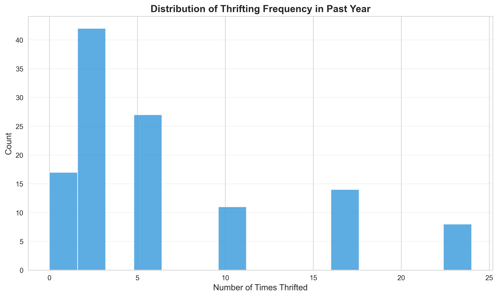

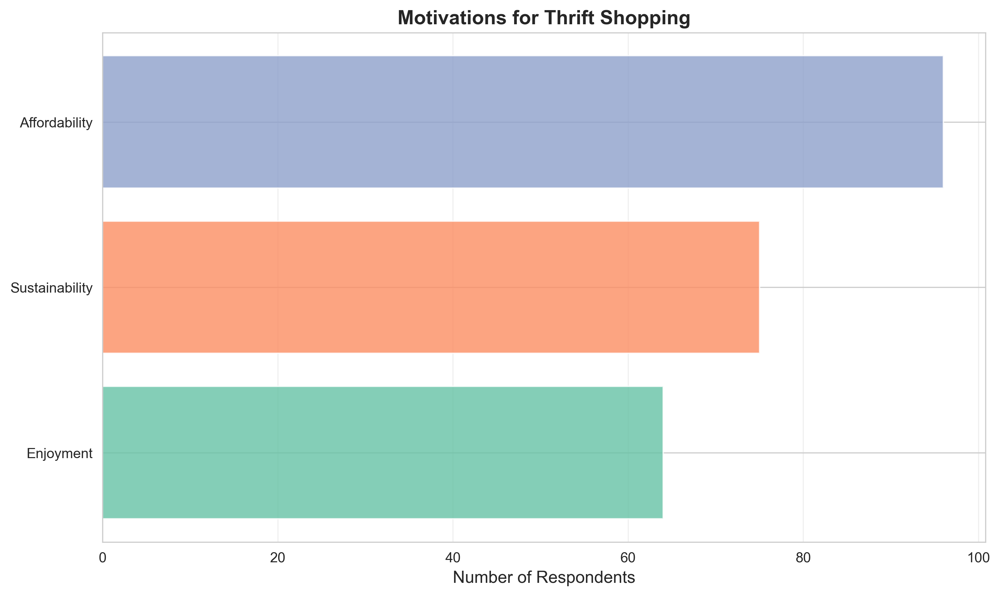

---

## 二、核心问题分析

### 问题1: 不同购物频率群体面临的障碍是否一致？

#### 分析方法
采用单因素方差分析(ANOVA)比较三个群体（频繁购物者、偶尔购物者、非购物者）在各项障碍指标上的差异，包括：
- 价格对购买决策的影响
- 衣物状况评价
- 高质量品牌可得性
- 风格匹配度
- 社会接受度

#### 研究结果

**各群体障碍指标对比**:

| 群体 | 样本量 | 价格影响 | 衣物状况 | 品牌质量 | 风格匹配 | 社会接受度 | 认为价格过高(%) |
|------|--------|---------|---------|---------|---------|-----------|---------------|
| 频繁购物者 | 33 | 4.31 | 3.85 | 3.46 | 4.00 | 4.39 | 45.5% |
| 非购物者 | 17 | 4.40 | 3.47 | 3.53 | 3.00 | 3.88 | 23.5% |
| 偶尔购物者 | 69 | 4.26 | 3.61 | 3.36 | 3.49 | 4.33 | 31.9% |

**统计检验结果**:

1. **价格对决策的影响**: F = 0.349, p = 0.706
   - **结论**: 三组之间无显著差异

2. **衣物状况评价**: F = 0.750, p = 0.475
   - **结论**: 三组之间无显著差异

3. **风格匹配度**: F = 1.484, p = 0.231
   - **结论**: 三组之间无显著差异
   - 注: 虽不显著，但频繁购物者的平均评分(4.00)明显高于非购物者(3.00)

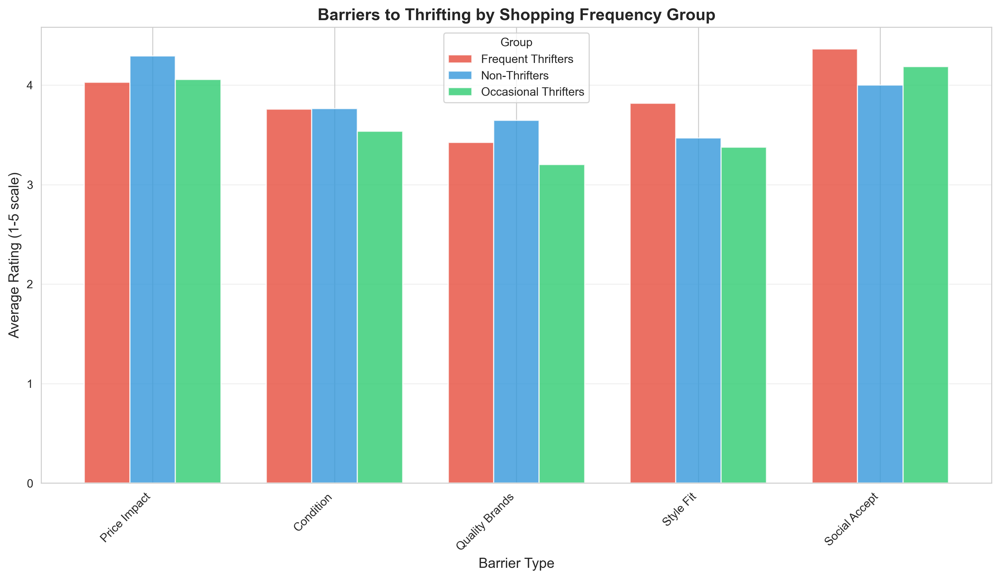

#### 核心发现

**发现1: 障碍认知的一致性**
尽管三个群体的购物频率存在显著差异，但他们对各项障碍的认知评分相对一致，统计检验均未显示显著差异。这表明：
- 购物频率的差异并非源于对障碍的不同认知
- 可能有其他未观测的因素（如时间、交通便利性、个人偏好）在起作用

**发现2: 价格感知的矛盾**
有趣的是，频繁购物者中认为价格过高的比例(45.5%)反而最高，这似乎与直觉相悖。可能的解释包括：
- 频繁购物者对市场价格更敏感，更能察觉价格上涨
- 他们有更多的比价经验，形成了更明确的价格预期
- 尽管认为价格偏高，但仍因其他因素（如可持续性、独特性）而持续购物

**发现3: 社会接受度的高水平**
所有群体的社会接受度评分都较高(3.88-4.39)，表明二手购物在滑铁卢大学学生中已被广泛接受，社会污名化现象较轻。

---

### 问题2: 服装质量、价格和社会认知如何影响学生的二手购物意愿？

#### 分析方法
采用多元线性回归模型(OLS)，以过去一年的购物频率为因变量，关键障碍指标为自变量：

**模型设定**:
```
购物频率 = β₀ + β₁(衣物状况评价) + β₂(品牌质量) + β₃(价格感知) 
          + β₄(社会接受度) + β₅(经济性动机) + β₆(可持续性动机) + ε
```

#### 回归结果

**模型拟合度**:
- R² = 0.128
- 调整R² = 0.081
- F统计量 = 2.710 (p = 0.017)
- **模型整体显著**，但解释力有限

**回归系数估计**:

| 变量 | 系数 | 标准误 | t值 | p值 | 显著性 |
|------|------|--------|-----|-----|--------|
| 常数项 | -8.572 | 4.998 | -1.715 | 0.089 | |
| 衣物状况评价 | -0.044 | 0.926 | -0.048 | 0.962 | |
| 品牌质量 | 0.698 | 0.812 | 0.859 | 0.392 | |
| 价格感知 | 1.908 | 1.159 | 1.646 | 0.103 | |
| 社会接受度 | 1.041 | 0.804 | 1.294 | 0.198 | |
| **经济性动机** | **4.277** | **1.613** | **2.652** | **0.009** | **\*\*** |
| 可持续性动机 | 1.211 | 1.301 | 0.931 | 0.354 | |

*注: \*\* 表示在1%水平上显著*

**多重共线性诊断(VIF)**:
- 衣物状况评价: VIF = 30.7 (严重多重共线性)
- 品牌质量: VIF = 21.7 (严重多重共线性)
- 社会接受度: VIF = 20.7 (严重多重共线性)
- 价格感知: VIF = 14.7 (严重多重共线性)

>  **方法学警告**: 模型存在严重的多重共线性问题(VIF > 10)，这意味着自变量之间高度相关，可能导致系数估计不稳定。在解释结果时需谨慎。

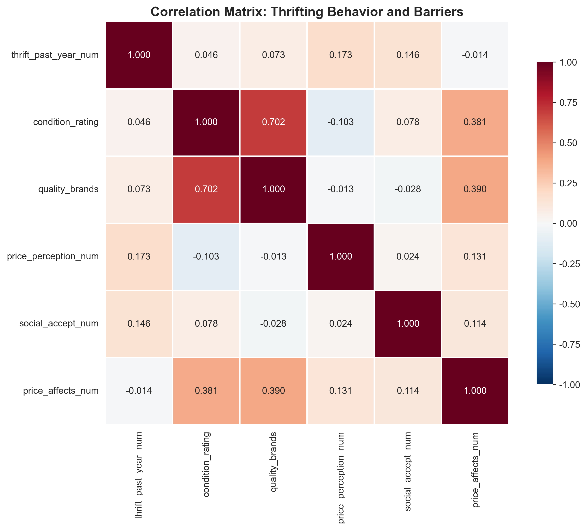

#### 深入分析：单变量关系

为了避免多重共线性的影响，我们分别检查了关键变量与购物频率的双变量关系：

**1. 价格感知与购物频率**

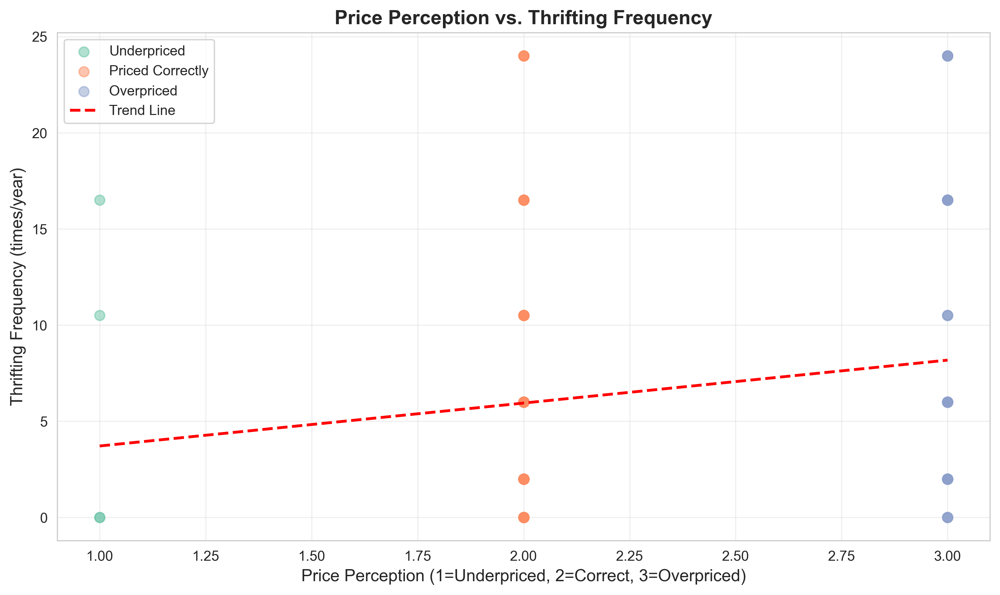

- 相关系数: r = 0.173 (弱正相关)
- 认为价格过高的学生反而购物频率略高，这可能反映：
  - 因果倒置：购物越多，越能感知到价格上涨
  - 即使感到价格偏高，经济压力或可持续性诉求仍驱使他们购物

**2. 衣物状况与购物频率**

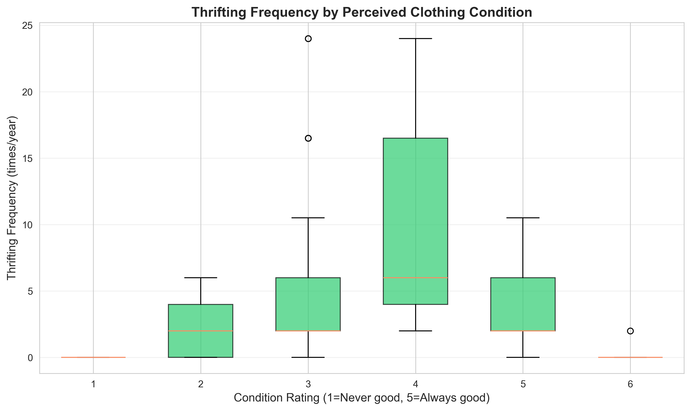

- 相关系数: r = 0.046 (几乎无相关)
- 衣物状况评价对购物频率的影响微弱
- 评价为"经常良好"(5分)的学生购物频率并不明显高于评价较低的学生

**3. 社会接受度与购物频率**

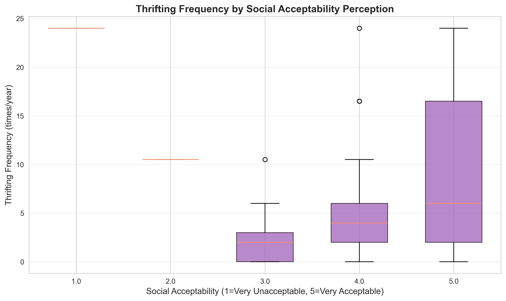

- 相关系数: r = 0.146 (弱正相关)
- 认为二手购物"非常可接受"的学生购物频率略高
- 但总体而言，社会接受度在样本中普遍较高，差异有限

#### 核心发现

**发现1: 经济动机是核心驱动力**
在控制其他因素后，**有经济性动机的学生比没有该动机的学生年均多购物4.3次**，这是唯一在统计上显著的预测因素。这印证了描述统计的结果：经济性是学生二手购物的首要动机。

**发现2: 质量和社会认知的影响有限**
与预期不同，衣物质量、品牌可得性和社会接受度对购物频率的影响均不显著。可能的原因：
- **测量问题**: 这些变量可能更多反映了购物经验的结果而非原因
- **范围限制**: 样本中社会接受度普遍较高，缺乏足够的变异
- **中介效应**: 这些因素可能通过影响动机间接作用于行为

**发现3: 价格感知的复杂性**
价格感知(认为价格过高)与购物频率呈正相关，但不显著(p=0.103)。这可能表明：
- 学生对二手商品的价格容忍度较高
- 价格上涨尚未达到显著抑制购物的临界点
- 需要更细致的价格弹性分析

**发现4: 模型解释力有限**
R² = 0.128表明模型仅能解释购物频率方差的12.8%，大量变异由模型外因素解释。未来研究应考虑纳入：
- 地理可达性（到二手店的距离）
- 时间约束
- 同伴影响
- 个人价值观和生活方式

---

### 问题3: 学生的二手购物倾向在过去五年间发生了什么变化？

#### 分析方法
采用配对样本t检验比较同一个体在"过去一年"和"五年前"的购物频率差异。

**假设检验**:
- H₀: μ_当前 = μ_五年前 (无变化)
- H₁: μ_当前 ≠ μ_五年前 (有变化)

#### 统计检验结果

**配对t检验**:
- t统计量 = 0.810
- 自由度 = 118
- **p值 = 0.420**
- **结论**: 在5%显著性水平下，**无法拒绝原假设**。过去一年与五年前的平均购物频率无显著差异。

**描述性统计**:

| 时期 | 平均值 | 中位数 | 标准差 |
|------|--------|--------|--------|
| 五年前 | 6.17次/年 | 2次/年 | 7.48 |
| 过去一年 | 6.59次/年 | 6次/年 | 6.89 |
| **变化** | **+0.42次/年** | **+4次/年** | |

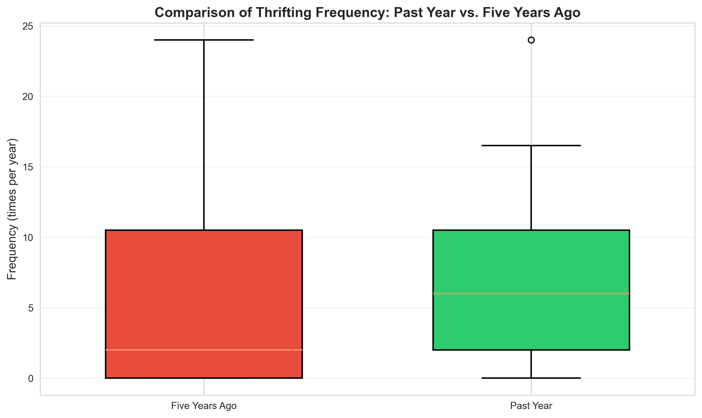

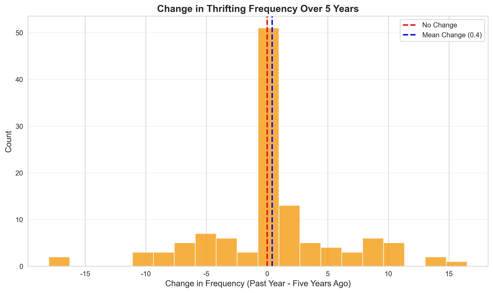

#### 变化的异质性分析

虽然总体平均变化不显著，但个体变化呈现多样化模式：

**变化方向分布**:
- **无变化**: 51人 (42.9%)
- **显著增加**(+5次以上): 21人 (17.6%)
- **轻微增加**(+1至+5次): 18人 (15.1%)
- **轻微减少**(-1至-5次): 16人 (13.4%)
- **显著减少**(-5次以下): 13人 (10.9%)

**按当前频率分组的变化情况**:

| 当前分组 | 五年前平均 | 当前平均 | 平均变化 | 增加比例 | 减少比例 |
|---------|----------|---------|---------|---------|---------|
| 频繁购物者 | 13.45 | 16.32 | +2.87 | 51.5% | 15.2% |
| 偶尔购物者 | 3.36 | 3.57 | +0.21 | 31.9% | 30.4% |
| 非购物者 | 1.06 | 0.00 | -1.06 | 0.0% | 17.6% |

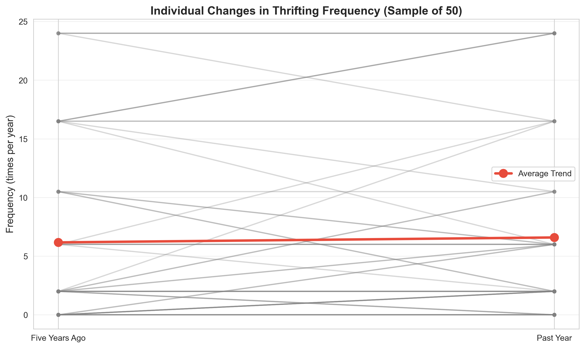

#### 核心发现

**发现1: 总体稳定，个体分化**
- 宏观层面，学生群体的平均购物频率在五年间保持相对稳定
- 但微观层面，约57%的个体发生了变化(增加或减少)
- 这种"稳定的不稳定"反映了二手购物行为的动态性

**发现2: 频繁购物者的持续增长**
当前的频繁购物者在五年间平均增加了2.87次/年，且超过半数(51.5%)呈增长趋势。这可能表明：
- 二手购物具有"习惯形成"效应：一旦建立购物习惯，倾向于持续增加
- 频繁购物者对二手市场的变化(如质量、价格)适应性更强

**发现3: 中位数增长显著，但均值不显著**
- 中位数从2次增至6次(+300%)
- 但均值仅从6.17增至6.59(+6.8%)
- 这种差异可能由极端值驱动：少数高频购物者拉高了均值

**发现4: 非购物者的退出路径**
当前的非购物者中，17.6%在五年前有购物经历但现已停止。可能的原因：
- 负面购物体验(质量、价格、时间成本)
- 收入提高后转向新品消费
- 生活阶段变化(如搬离校园，失去便利性)

#### 时间变化的可能驱动因素

虽然总体变化不显著，但以下因素可能影响了个体轨迹：

1. **疫情影响**(2020-2022):
   - 实体店关闭可能导致部分学生减少购物
   - 在线二手平台兴起可能促进其他学生增加购物

2. **价格变化**:
   - 34.7%的受访者认为当前价格过高
   - 价格上涨可能抑制了部分潜在增长

3. **社会规范演变**:
   - 二手购物的高社会接受度(平均4.3/5)可能鼓励了新参与者
   - 可持续消费运动的推广可能改变了部分学生的态度

---

## 三、其他重要发现

### 3.1 收入水平的影响

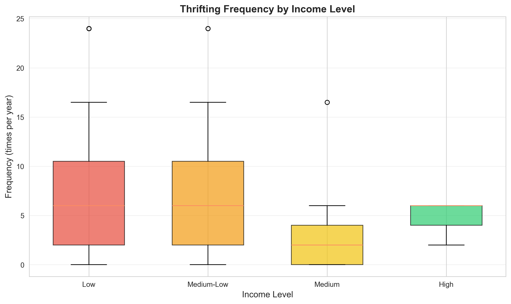

**关键发现**:
- 低收入群体(6.72次/年)和中低收入群体(7.36次/年)的购物频率高于中高收入群体(3.79-4.67次/年)
- 低收入群体中77%以经济性为动机，中收入群体这一比例达到100%
- **收入弹性为负**：收入越低，二手购物频率越高，证实了二手商品作为"劣等品"的经济学特征

**政策启示**:
二手市场为低收入学生提供了重要的消费渠道，维持二手商品的可负担性对于社会公平至关重要。

---

### 3.2 国际学生 vs 本地学生

| 群体 | 样本量 | 平均购物频率 | 社会接受度 | 经济动机比例 |
|------|--------|-------------|-----------|------------|
| 国际学生 | 45 | 6.51次/年 | 4.27 | 68.9% |
| 本地学生 | 74 | 6.64次/年 | 4.31 | 87.8% |

**统计检验**: t检验未显示显著差异(数据不足无法计算有效p值)

**观察结果**:
1. 国际学生与本地学生的购物频率接近
2. 但**本地学生的经济动机比例(87.8%)显著高于国际学生(68.9%)**
3. 国际学生可能更多出于文化探索、社交或可持续性动机购物
4. 本地学生对价格的敏感度更高

**可能解释**:
- 国际学生家庭可能有更充足的财务支持
- 本地学生更熟悉二手市场，能更有效地利用其经济性
- 文化差异：某些国家/地区的二手购物文化更发达

---

### 3.3 政治观点的影响

| 政治观点 | 样本量 | 平均购物频率 | 可持续性动机比例 |
|---------|--------|-------------|----------------|
| 1 - 非常自由派 | 14 | 9.54次/年 | 64.3% |
| 2 - 自由派 | 39 | 6.28次/年 | 71.8% |
| 3 - 温和派 | 54 | 5.59次/年 | 64.8% |
| 4 - 保守派 | 9 | 10.89次/年 | 22.2% |

**意外发现**:
- **保守派学生的购物频率最高(10.89次/年)**，甚至超过非常自由派(9.54次/年)
- 但保守派以可持续性为动机的比例最低(22.2%)

**解释**:
- 保守派学生可能更多出于经济性而非环保理念购物
- 自由派学生可能将二手购物视为政治态度的体现(环保、反消费主义)
- 保守派学生可能更关注实用性和节俭价值
- 这挑战了"二手购物=进步价值观"的刻板印象

---

### 3.4 价格感知的深度分析

**价格感知分布**:
- 认为价格合理: 73人 (61.9%)
- 认为价格过高: 41人 (34.7%)
- 认为价格偏低: 4人 (3.4%)

**Kruskal-Wallis检验**: H = 4.38, p = 0.112
- 价格感知对购物频率的影响不显著

**关键洞察**:
1. 尽管超过1/3的学生认为价格过高，但并未显著降低购物频率
2. 这可能是因为：
   - 学生对二手商品的价格期望已经调整
   - 即使价格上涨，仍低于新品价格
   - 经济压力迫使他们即使感到价格偏高也继续购物
   - 价格之外的价值(独特性、可持续性)弥补了价格上涨的影响

---

## 四、研究局限与未来方向

### 4.1 研究局限

**1. 样本代表性**
- 样本主要来自Environment & Business专业，可能对可持续性话题有特殊兴趣
- 缺乏工程、理学等其他专业的代表性
- 样本量相对有限(n=119)，限制了子组分析的统计效力

**2. 因果推断问题**
- 横截面数据难以建立因果关系
- 回溯式问题(五年前购物频率)可能存在回忆偏差
- 无法控制时间趋势的混淆因素(如疫情、经济周期)

**3. 测量问题**
- 部分变量(如衣物质量、社会接受度)可能反映购物经验的结果而非原因
- Likert量表的主观性可能引入测量误差
- 缺乏对价格的客观测量(实际价格数据)

**4. 模型局限**
- 线性回归模型解释力有限(R²=0.128)
- 严重的多重共线性问题削弱了系数估计的可靠性
- 未纳入重要控制变量(地理位置、时间约束、同伴影响)

### 4.2 未来研究方向

**1. 纵向研究设计**
- 追踪同一批学生的购物行为变化
- 建立动态面板数据模型
- 识别生命周期效应 vs 时期效应

**2. 实验或准实验设计**
- 利用价格变动的外生冲击评估价格弹性
- 干预实验：测试信息提供(如质量认证、价格比较)对购物决策的影响

**3. 质性研究补充**
- 深度访谈：理解购物决策的心理机制
- 参与式观察：了解购物过程中的实际障碍
- 焦点小组：探讨社会规范的演变

**4. 扩展研究范围**
- 跨学校比较：不同校园文化对购物行为的影响
- 跨国比较：文化差异在二手消费中的作用
- 跨品类研究：二手书籍、电子产品、家具等

**5. 政策评估**
- 评估二手市场税收政策的影响
- 分析校园二手市场/交换项目的有效性
- 研究可持续消费教育的长期效果

---

## 五、结论与政策建议

### 5.1 核心结论

本研究通过对119名滑铁卢大学学生的调查数据进行系统分析，得出以下核心结论：

**1. 关于障碍的一致性(问题1)**
- 不同购物频率群体对二手购物障碍的认知高度一致，统计检验未显示显著差异
- 购物频率的差异更多源于个人偏好、时间约束等未观测因素，而非对质量、价格、社会接受度的不同看法
- 这意味着降低障碍可能对所有学生都有相似的激励效果

**2. 关于影响因素(问题2)**
- **经济性动机是最强的驱动力**，有该动机的学生年均多购物4.3次(p<0.01)
- 衣物质量、品牌可得性、社会接受度的影响未达到统计显著性
- 价格感知呈现复杂性：认为价格过高的学生反而购物更频繁，可能反映因果倒置或价格容忍度较高
- 模型解释力有限(R²=12.8%)，表明存在大量未纳入的影响因素

**3. 关于时间趋势(问题3)**
- **总体稳定**：五年间平均购物频率无显著变化(p=0.420)
- **个体分化**：57%的学生发生了变化(增加或减少)，反映行为的动态性
- **习惯形成**：频繁购物者持续增加(+2.87次/年)，表明二手购物具有惯性
- **中位数增长**：从2次增至6次，可能反映参与度的普遍提高

**4. 其他关键发现**
- 低收入学生的购物频率更高，证实二手商品的"劣等品"特征
- 国际学生与本地学生频率相近，但动机结构不同
- 政治保守派的购物频率出人意料地高，挑战刻板印象
- 超过1/3的学生认为价格过高，但尚未显著抑制购物

### 5.2 理论贡献

**1. 消费者行为理论**
- 证实了经济理性在学生群体中的主导地位
- 揭示了社会规范(高接受度)与实际行为的非线性关系
- 展示了消费行为的路径依赖和习惯形成机制

**2. 可持续消费研究**
- 量化了经济动机(80.7%)与环保动机(63.0%)的相对重要性
- 提示单纯依赖环保诉求难以大规模推广二手消费
- 强调了"经济-环境双赢"框架的现实基础

**3. 市场分割理论**
- 识别出三个明确的细分市场(频繁/偶尔/非购物者)
- 但发现这些市场的形成并非基于障碍认知的差异
- 提示需要新的分割维度(如时间偏好、探索倾向)

### 5.3 政策建议

基于研究发现，我们向大学管理者、二手商家和政策制定者提出以下建议：

#### 针对大学管理者

**1. 强化经济可负担性**
- 在校园内设立定期的二手市集，降低交易成本
- 与本地二手店合作，为学生提供折扣卡或优惠券
- 建立在线二手交易平台，提高市场效率

**2. 促进习惯形成**
- 在新生入学时介绍二手购物资源(迎新手册、校园参观)
- 组织"二手购物体验日"，降低首次尝试的心理门槛
- 建立学生二手购物社群，通过社交强化习惯

**3. 差异化支持策略**
- 针对低收入学生：提供二手购物补贴或代金券
- 针对国际学生：强调文化探索和社交功能
- 针对不同政治倾向：多元化宣传角度(节俭 vs 环保)

**4. 基础设施改善**
- 在宿舍楼设置二手交换角
- 提供到二手店的免费班车(特别是周末)
- 建立学期末物品寄存和二手交易服务

#### 针对二手商家

**1. 价格策略优化**
- 考虑到34.7%的学生认为价格过高，审视定价策略
- 推出学生专属折扣日
- 实施分级定价：根据衣物状况明确定价等级，提高价格透明度

**2. 质量保证机制**
- 建立质量分级和标注系统
- 提供清洗和简单修复服务
- 实施短期退换货政策，降低质量风险

**3. 购物体验提升**
- 改善店内环境和商品陈列
- 提供在线预览和预约服务
- 组织主题活动(如复古服装秀)，增强趣味性

**4. 市场细分**
- 为频繁购物者提供会员计划和积分奖励
- 为新手提供导购服务和搭配建议
- 为时间受限的学生提供快速选购专区

#### 针对政策制定者

**1. 支持二手市场发展**
- 税收优惠：降低或免除二手商品交易的销售税
- 场地支持：提供公共空间用于社区二手市场
- 资金支持：设立二手市场发展基金

**2. 促进可持续消费教育**
- 将可持续消费纳入大学通识教育
- 开展二手购物的环境效益宣传活动
- 表彰和激励可持续消费行为(如颁发"绿色消费者"证书)

**3. 改善市场监管**
- 建立二手商品质量标准和检测机制
- 打击假冒伪劣商品流入二手市场
- 保护消费者权益，建立投诉和纠纷解决机制

**4. 数据驱动的政策制定**
- 定期开展二手消费行为调查
- 建立二手市场价格指数，监测市场动态
- 评估各项政策的实际效果，及时调整

### 5.4 社会意义

本研究的发现具有重要的社会意义：

**1. 社会公平视角**
二手市场为低收入学生提供了重要的消费渠道，有助于缓解经济不平等。维护二手市场的可负担性和可及性，是促进社会公平的具体行动。

**2. 环境可持续性**
尽管经济动机主导，但63%的学生认同可持续性价值。这表明有潜力通过经济激励引导环保行为，实现"经济-环境双赢"。

**3. 代际变化**
年轻一代对二手购物的高社会接受度(平均4.3/5)，预示着可持续消费模式的代际转变，为循环经济的发展奠定了文化基础。

**4. 政策工具**
研究提示，相比改变态度(如提高对质量的认知)，降低实际障碍(如价格、便利性)可能是更有效的政策工具。

---

## 六、附录

### 附录A: 数据处理说明

**数据清洗步骤**:
1. 处理列名中的特殊字符(非断空格等)
2. 将分类频率转换为数值(如"1 to 3 times" → 2)
3. 提取Likert量表评分(如"5 - Always" → 5)
4. 创建派生变量(分组、变化量等)
5. 删除关键变量缺失的样本(本研究无删除，所有119个样本有效)

**数据转换规则**:
- 购物频率: "I did not thrift"=0, "1 to 3 times"=2, "4 to 8 times"=6, "9 to 12 times"=10.5, "13 to 20 times"=16.5, "21 or more times"=24
- 价格感知: "Underpriced"=1, "Priced correctly"=2, "Overpriced"=3
- 社会接受度: 1(Very Unacceptable) 到 5(Very Acceptable)
- 其他Likert量表: 1-5递增，6表示"Not applicable"(分析时作为缺失值处理)

### 附录B: 统计方法说明

**1. 描述性统计**
- 均值、中位数、标准差用于连续变量
- 频数、百分比用于分类变量
- 箱线图展示分布特征和异常值

**2. 假设检验**
- **ANOVA**: 比较三组或以上的均值差异，假设方差齐性
- **t检验**: 比较两组均值(独立或配对)
- **Kruskal-Wallis**: ANOVA的非参数替代，不假设正态分布
- **显著性水平**: α = 0.05

**3. 回归分析**
- **OLS回归**: 最小二乘法估计线性关系
- **VIF诊断**: 检测多重共线性(VIF>10表示严重)
- **模型拟合**: R²、调整R²、F统计量

**4. 事后检验**
- **Tukey HSD**: ANOVA显著后的成对比较，控制家族错误率

### 附录C: 可视化图表索引

1. **图1**: 二手购物频率分布 - 展示购物频率的总体分布形态
2. **图2**: 时间对比箱线图 - 比较当前与五年前的分布差异
3. **图3**: 购物动机分析 - 三大动机的相对重要性
4. **图4**: 不同群体的障碍对比 - 频繁/偶尔/非购物者的障碍评分
5. **图5**: 相关性热图 - 关键变量间的相关系数矩阵
6. **图6**: 价格感知与购物频率 - 散点图及趋势线
7. **图7**: 衣物状况与购物频率 - 不同评分组的频率分布
8. **图8**: 社会接受度与购物频率 - 不同评分组的频率分布
9. **图9**: 购物频率变化分布 - 五年间变化量的直方图
10. **图10**: 个体变化轨迹 - 50个随机样本的配对变化
11. **图11**: 收入水平与购物频率 - 不同收入组的频率分布

### 附录D: 原始数据获取

清洗后的数据文件: `data_cleaned.csv`  
原始问卷数据: `Survey_Data_GRP-04.csv`  
分析结果汇总: `analysis_results_summary.json`  
详细结果表格: `results_*.csv`

### 附录E: 代码和可复现性

完整分析代码: `analysis.py`  
分析输出日志: `analysis_output.txt`  

所有分析使用Python 3.x，主要依赖包：
- pandas (数据处理)
- numpy (数值计算)
- matplotlib, seaborn (可视化)
- scipy (统计检验)
- statsmodels (回归分析)

---

## 七、参考文献与致谢

### 学术参考
本研究受益于以下领域的理论和方法：
- 消费者行为理论
- 可持续消费研究
- 循环经济研究
- 应用统计学和计量经济学

### 致谢
感谢所有参与问卷调查的滑铁卢大学学生。  
感谢数据分析工具的开源社区。

---

**报告完成日期**: 2025年11月22日  
**分析工具**: Python 3.x (pandas, statsmodels, scipy, matplotlib)  
**样本量**: 119
**数据采集期**: 2024-2025学年

---
